## Social Media Data Based Personality Analyzer
### What Can This App Do?
This app gives a quantitative description of a twitter user's personality based on his/er recent tweets.  

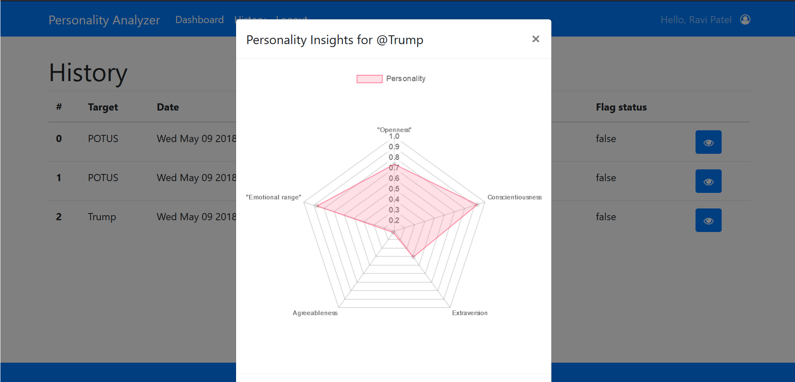   

### Why do We Create it?
We still vividly remember the heartbroken news in February 15, that is, a 19-year-old teenager killed 17 of his schoolmates and teachers and injured dozens at Marjory Stoneman Douglas High School in Parkland, Florida.  

The incident did not happen without any sign. Nikolas Cruz, the shooter, had explicitly expressed his violent inclination on social media at one time or another. Furthermore, instead of being shocked, many of his schoolmates said they were not surprised for what Nikolas did. One of them even told local radio station WFOR “Everyone predicted it”.    

Although so many peers of the shooter have detected his abnormal behavior, none of them warned the
local police department of the shooter’s possible violence. One reason could be that they just felt that way, but they didn’t have a substantial evidence to corroborate their feelings until the tragedy finally happened.  

**What if** they have an analysis tool that can corrobarate or disprove their suspicion?

Our personality analyzer app is our answer to this "what if" question. The app uses the power of IBM Watson to implement an quantitative analysis on a target's social media activities. The analysis helps substantiate the user's understanding about the twitter user of interest.

### How Does It Work?
In this project, we only focus on twitter as social media data source for analysis.   

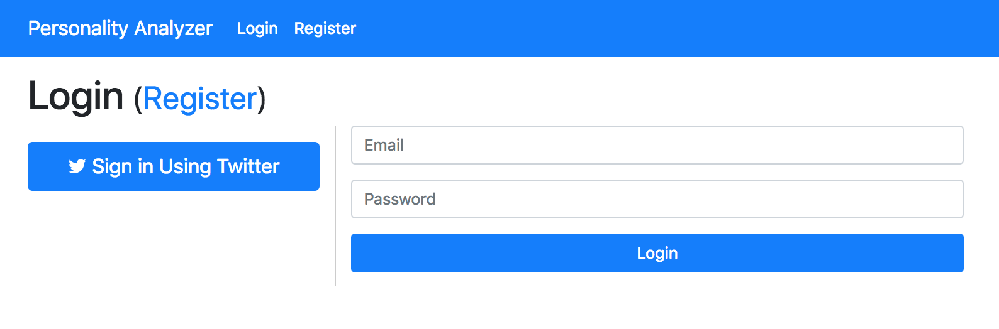 
A user logs in either through his/her Twitter Account or by typing in username and password.

Dashboard is where a user implements personality analysin on a target's tweets. The user only needs to enter the target's Twitter Handle, and the app does all of the heavy-duty work.  

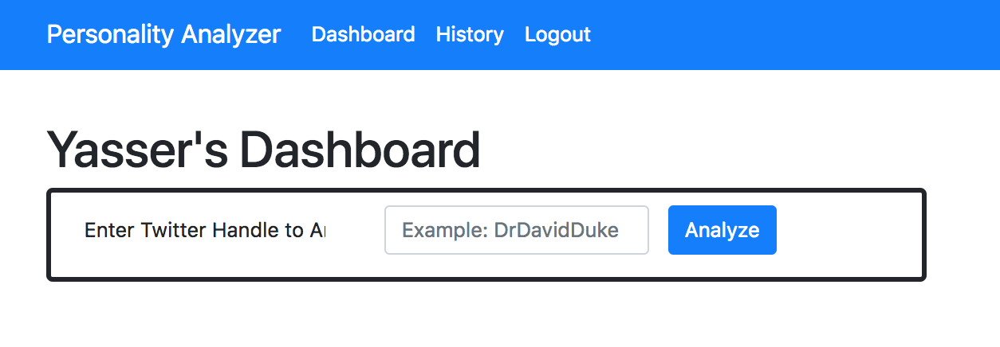 

To just give a taste of what you can have from our service, we dis analyses on some famous people.  

Hillary Clinton             |  Barack Obama
:-------------------------:|:-------------------------:
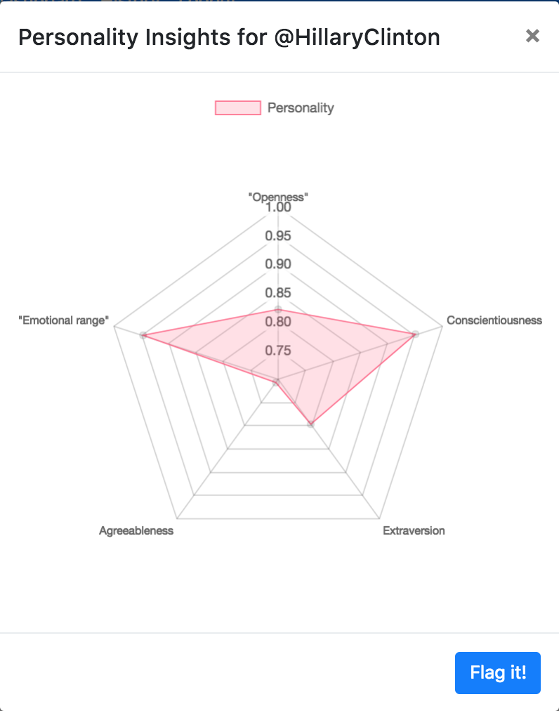  |  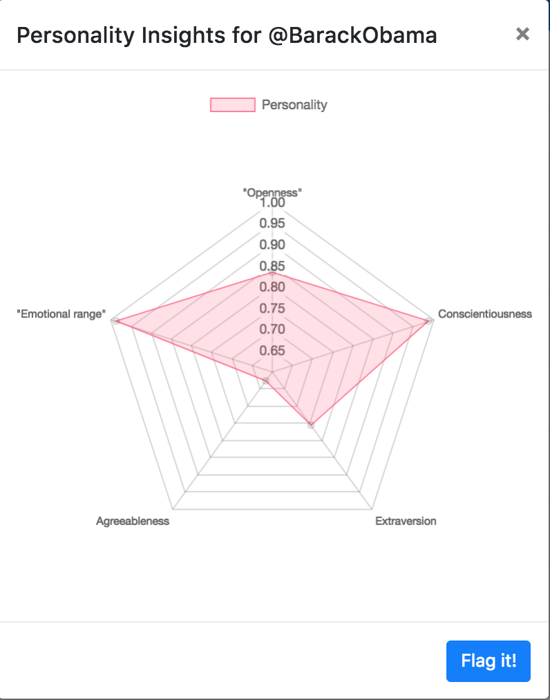

David Duke             |  Donald Trump
:-------------------------:|:-------------------------:
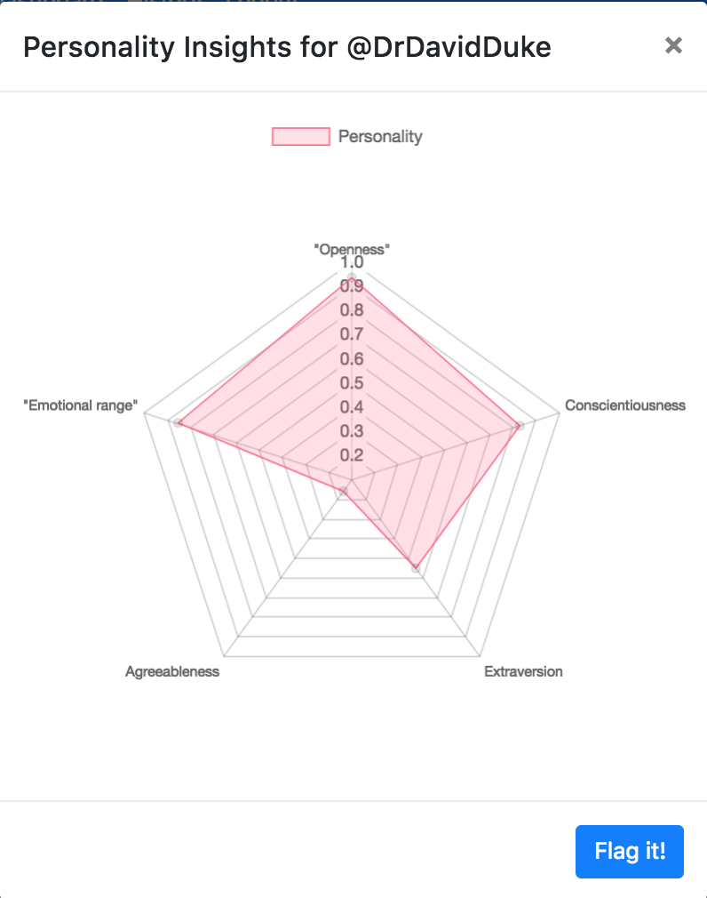  |  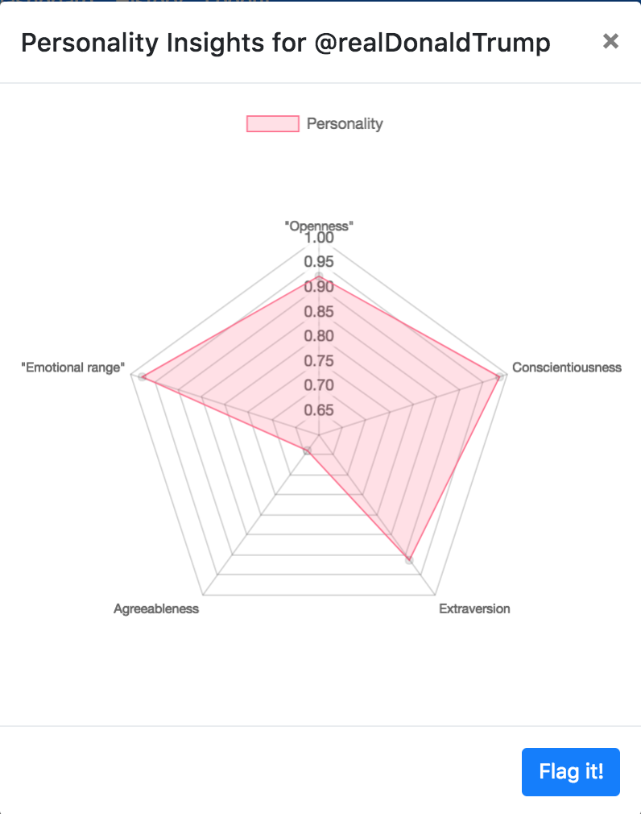

Pope Francis            |  Dalai Lama
:-------------------------:|:-------------------------:
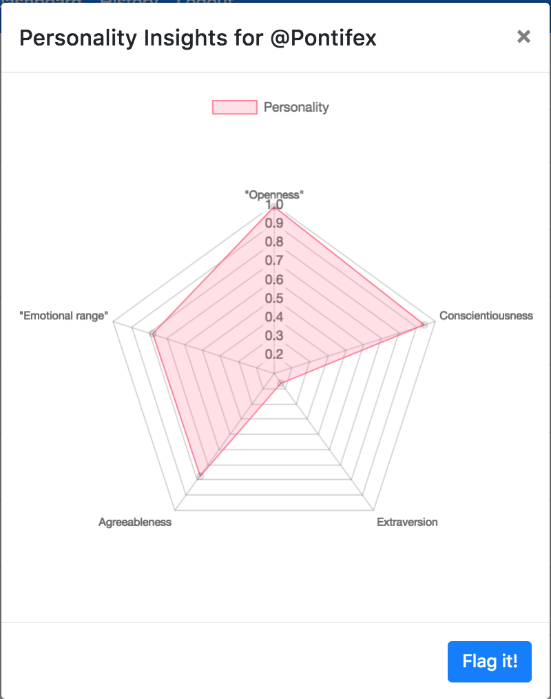  |  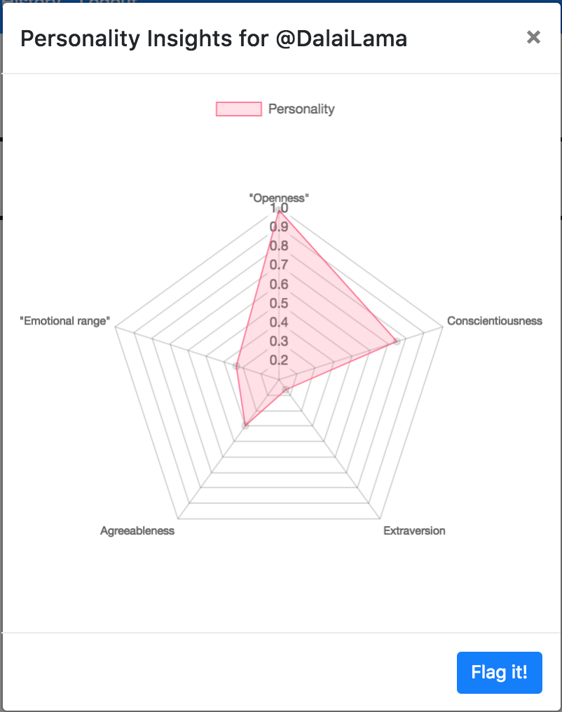
The user is able to flag an analysis for further attention. The user is also able to see all of his/her historical searches. 

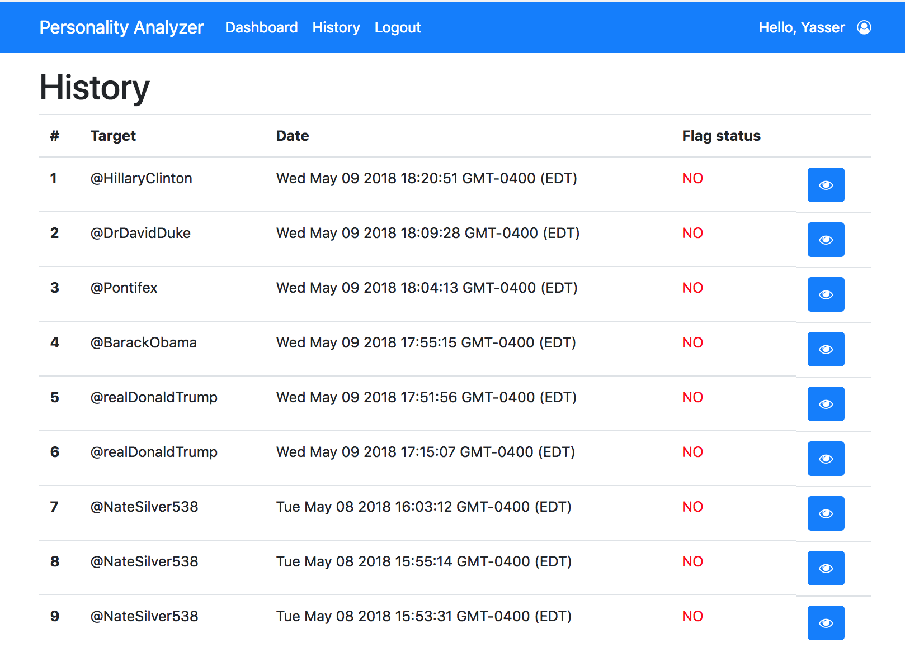 

If the user is an administrator, his/her dashboard is a little bit different, as shown below.

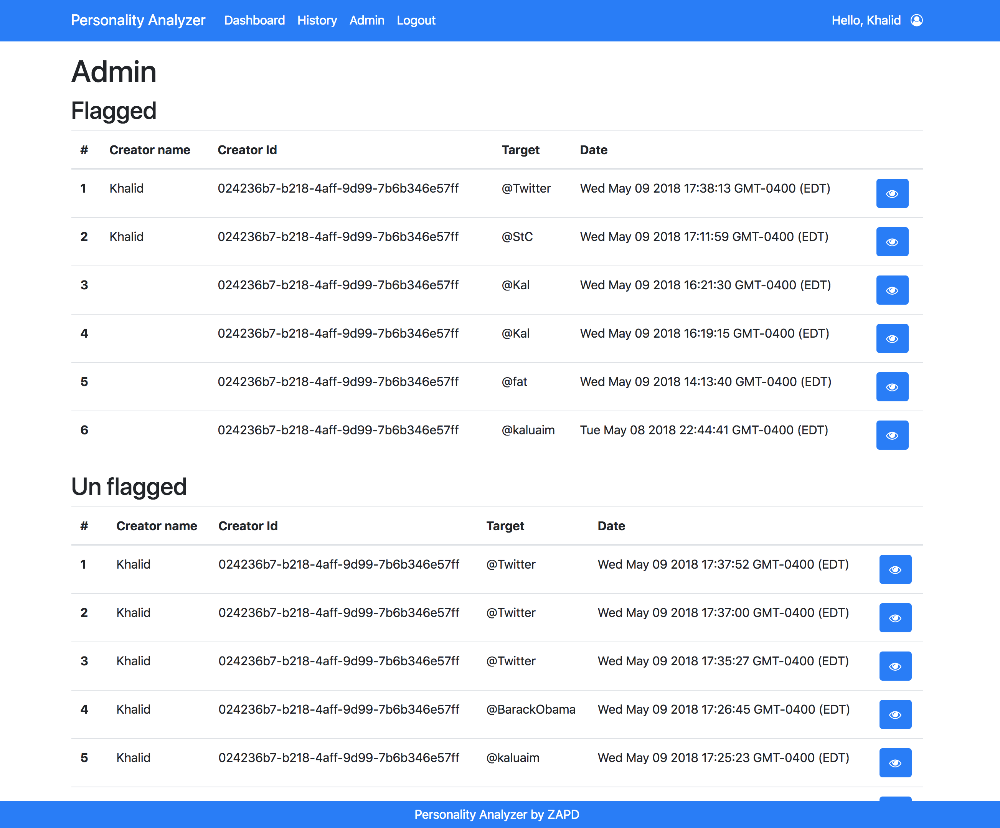 
